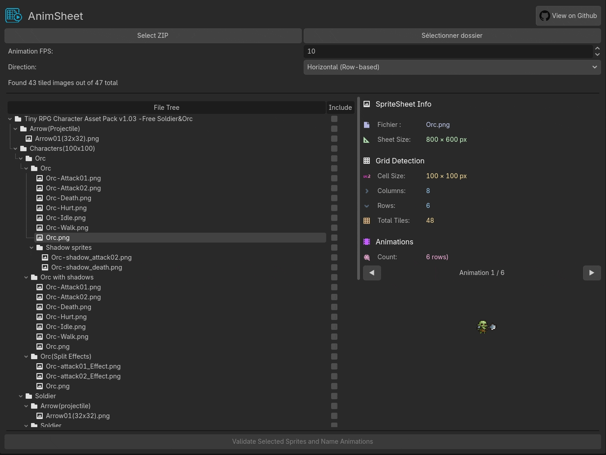
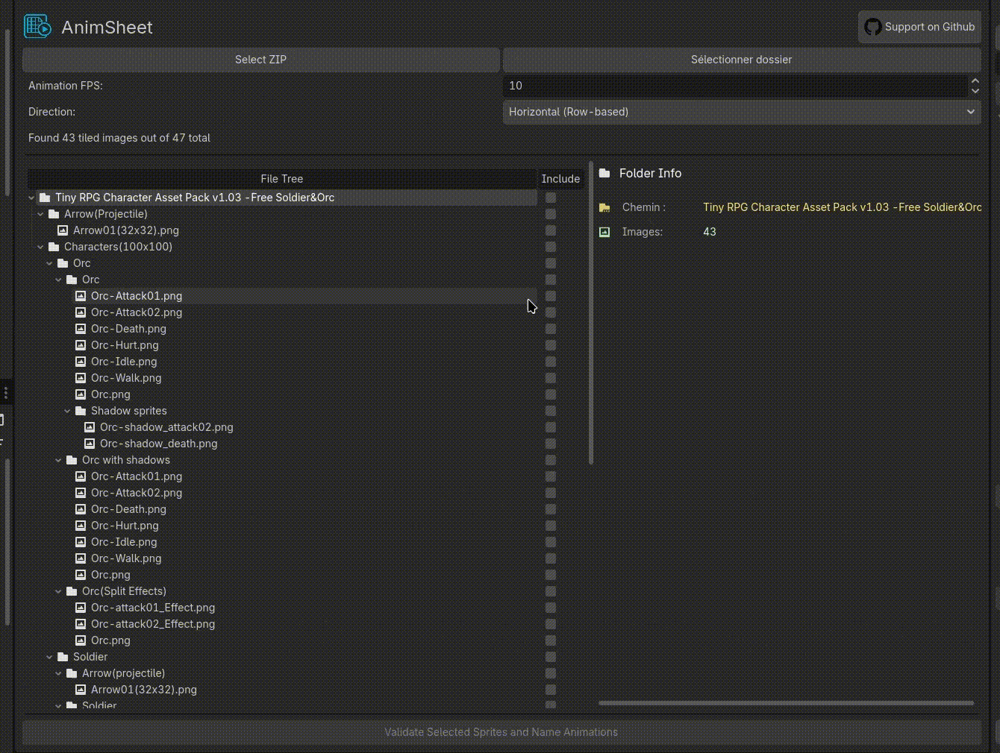
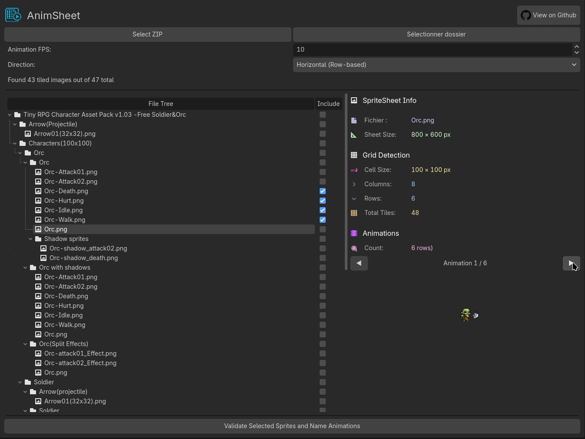
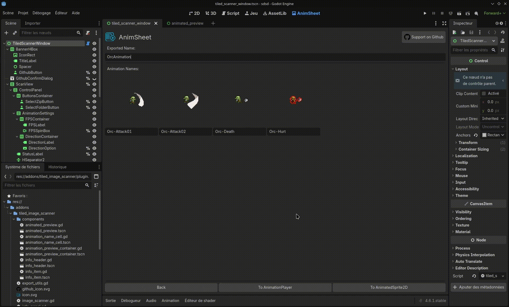
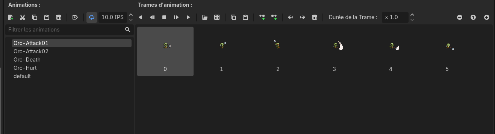
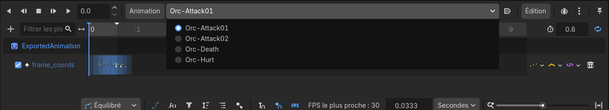

# 🎬 AnimSheet
✨ Turn your sprite sheets into fully-animated sprites with just a few clicks! ✨

**Batch process your sprite sheets like a pro.** Scan entire folders or ZIP archives, detect grids automatically, and export ready-to-use AnimatedSprite2D or AnimationPlayer nodes with custom naming.

**SpriteSheet Source:** [Zerie Tiny RPG Pack](https://zerie.itch.io/tiny-rpg-character-asset-pack)

---

## ✨ What's New in V2

AnimSheet V2 is a **complete rewrite** from scratch focused on batch processing workflows. If you've used V1, you'll notice this version takes a different approach handling multiple sprite sheets efficiently in one go.

**V2 brings you:**
- 📦 **Batch scanning** - Process folders or ZIP archives full of sprite sheets
- 🔍 **Automatic grid detection** - Frequency-based analysis finds tile sizes for you
- 🎨 **Custom naming workflow** - Name your animations before export

**Important:** V2 doesn't allow manual drag and select currently. If you need the original V1 with manual frame selection, check out the V1 branch. I will try to add it in the future.

---

## 🎯 Features

### Batch Processing Made Easy
Stop importing sprite sheets one at a time! Load an entire folder or ZIP archive and let AnimSheet scan everything at once.

- Scan folders recursively, identify spritesheets among all files.
- Extract and process ZIP archives on the fly

### Smart Grid Detection
AnimSheet analyzes your sprite sheets using frequency-based column and row detection to find consistent tile patterns.

### Custom Naming System
Give your animations meaningful names before export:

### Export Options

**🎬 AnimatedSprite2D** 

Possible thanks to cenairaclub implementation in V1 !

**🎮 AnimationPlayer**

Get a Sprite2D + AnimationPlayer pair for advanced animation control and scripting.

---

## 📥 Installation

### From Asset Library 
Not available yet for V2

### Manual Installation
1. Grab the `addons/anim_sheet` folder from this repo
2. Drop it into your project's `addons/` directory
3. Enable in **Project → Project Settings → Plugins**

---

## 🚀 How to Use

### Step 1: Open AnimSheet
Look for the AnimSheet tab in the top toolbar.

### Step 2: Load Your Sprite Sheets
Two ways to load:
- **Select Folder** - Scan a directory for images
- **Select ZIP** - Extract and scan an archive

AnimSheet will automatically detect grid dimensions for each sprite sheet it finds.

### Step 3: Select animations and configuration
- Select animations from the tree.
- Set your **FPS** (frames per second)
- Choose **Direction** of spritesheets: Horizontal (row-based) or Vertical (column-based)

Hit **Validate** when you're ready!

### Step 5: Name Your Animations

### Step 6: Export !
Pick your format:
- **AnimatedSprite2D** for simple, self-contained animated sprites
- **AnimationPlayer** for sprites with separate animation control

Nodes are created directly in your currently open scene. Done! 🎉

---

## 🔧 Technical Details

I wanted to be able to import spritesheets very easily, so I used an algorithm to which images are spritesheets and their sprites sizes. 
I tried bounding box first which didn't works well enough.

So AnimSheet uses **autocorrelation-based pattern detection**, a signal processing technique that finds repeating patterns in data:

1. **Projection Building** - Creates horizontal and vertical projections by counting non-transparent pixels along each row and column
2. **Autocorrelation Analysis** - Correlates each projection with shifted versions of itself to detect periodic patterns 
3. **Peak Detection** - Identifies prominent peaks in the autocorrelation signal 
4. **Grid Optimization** - Refines the detected spacing by testing divisors of the image dimensions and scoring them based on:
   - How well they align with detected periods
   - Minimizing pixel density at grid boundaries (finding the "gaps" between tiles)

This works very well with most sprite sheets I tested.

---

## 📜 License

AnimSheet is licensed under the **MIT License**. See [LICENSE.md](LICENSE.md) for the full text.

**TL;DR:** Use it in your personal projects, commercial games, game jams ! Free and open source. 

---

**Enjoy using AnimSheet?** Consider starring the repo or sharing it with other game devs! 🌟
