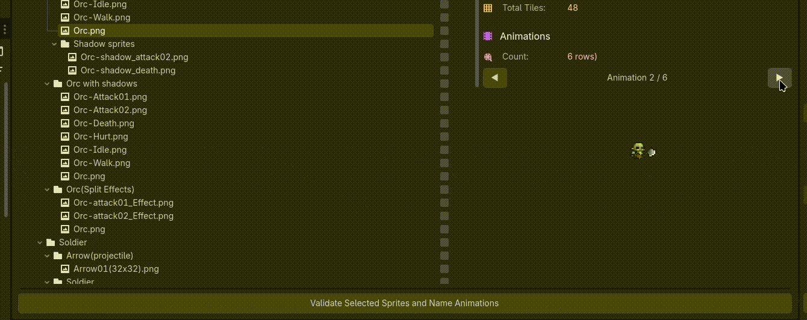

# AnimSheet V2 ⚡

**Batch process your sprite sheets like a pro.** Scan entire folders or ZIP archives, detect grids automatically, and export ready-to-use AnimatedSprite2D or AnimationPlayer nodes with custom naming.

**SpriteSheet Source:** [Snoblin's Pixel RPG Free NPC](https://snoblin.itch.io/pixel-rpg-free-npc)

---

## ✨ What's New in V2

AnimSheet V2 is a **complete rewrite** focused on batch processing workflows. If you've used V1, you'll notice this version takes a different approach - it's all about handling multiple sprite sheets efficiently in one go.

**V2 brings you:**
- 📦 **Batch scanning** - Process folders or ZIP archives full of sprite sheets
- 🔍 **Automatic grid detection** - Frequency-based analysis finds tile sizes for you
- 🎨 **Custom naming workflow** - Name your animations before export
- 🚀 **Streamlined export** - Choose AnimatedSprite2D or AnimationPlayer output

**Important:** V2 doesn't allow manual drag and select currently. If you need the original V1 with manual frame selection, check out the V1 branch.

---

## 🎯 Features

### Batch Processing Made Easy
Stop processing sprite sheets one at a time! Load an entire folder or ZIP archive and let AnimSheet scan everything at once.

- Scan folders recursively for all your sprite sheets
- Extract and process ZIP archives on the fly
- Handle multiple image formats (PNG, JPG, WEBP, and more)

### Smart Grid Detection
AnimSheet analyzes your sprite sheets using frequency-based column and row detection to find consistent tile patterns:

- ✓ Detects cell width and height automatically
- ✓ Finds grid offsets for sheets with padding
- ✓ Works great with evenly-spaced tiles
- ✓ Manual override available for any parameter

**What it doesn't do:** AnimSheet V2 won't detect individual animations or optimize frame counts. Every row or column becomes its own animation - perfect for organized sprite sheets!

### Custom Naming System
Give your animations meaningful names before export:

- Name each animation strip (idle, walk, run, attack, etc.)
- Set a base node name for your exports
- Configure direction (horizontal rows or vertical columns)
- Preview everything before committing

### Export Options

Choose the format that fits your workflow:

**🎬 AnimatedSprite2D** - All-in-one solution

Perfect for simple sprite animations. Everything's bundled in a single node.

**🎮 AnimationPlayer** - Maximum control

Get a Sprite2D + AnimationPlayer pair for advanced animation control and scripting.

---

## 📥 Installation

### From Asset Library (Recommended)
1. Open Godot and head to the **AssetLib** tab
2. Search for **AnimSheet**
3. Download and install
4. Enable it in **Project → Project Settings → Plugins**

### Manual Installation
1. Grab the `addons/anim_sheet` folder from this repo
2. Drop it into your project's `addons/` directory
3. Enable in **Project → Project Settings → Plugins**

---

## 🚀 How to Use

### Step 1: Open AnimSheet
Look for the AnimSheet tab in the top toolbar - it sits right next to 2D, 3D, and Script.

### Step 2: Load Your Sprite Sheets
Two ways to load:
- **Select Folder** - Scan a directory for images
- **Select ZIP** - Extract and scan an archive

AnimSheet will automatically detect grid dimensions for each sprite sheet it finds.

### Step 3: Review the Results
Check out the tree view on the left. Each detected sprite sheet shows:
- 🖼️ Grid overlay preview
- 📊 Dimensions (cell size, columns, rows)
- 📐 Detected offset values
- ⚙️ Manual adjustment options

### Step 4: Configure Animation Settings
Before moving forward:
- Set your **FPS** (frames per second)
- Choose **Direction**: Horizontal (row-based) or Vertical (column-based)

Hit **Validate** when you're ready!

### Step 5: Name Your Animations
Now comes the fun part - name each animation strip:
- Set the base node name
- Give meaningful names to each animation (e.g., "idle", "walk", "jump")
- Use the built-in preview to see your animations play

### Step 6: Export
Pick your format:
- **AnimatedSprite2D** for simple, self-contained animated sprites
- **AnimationPlayer** for sprites with separate animation control

Nodes are created directly in your currently open scene. Done! 🎉

---

## 🔧 Technical Details

### Grid Detection Algorithm
AnimSheet uses **autocorrelation-based pattern detection**, a signal processing technique that finds repeating patterns in data:

1. **Projection Building** - Creates horizontal and vertical projections by counting non-transparent pixels along each row and column
2. **Autocorrelation Analysis** - Correlates each projection with shifted versions of itself to detect periodic patterns 
3. **Peak Detection** - Identifies prominent peaks in the autocorrelation signal 
4. **Grid Optimization** - Refines the detected spacing by testing divisors of the image dimensions and scoring them based on:
   - How well they align with detected periods
   - Minimizing pixel density at grid boundaries (finding the "gaps" between tiles)

This works very well with most sprite sheets I tested.

---

## 📜 License

AnimSheet is licensed under the **MIT License**. See [LICENSE.md](LICENSE.md) for the full text.

**TL;DR:** Use it in your personal projects, commercial games, game jams ! Free and open source. 

---

**Enjoy using AnimSheet?** Consider starring the repo or sharing it with other game devs! 🌟
